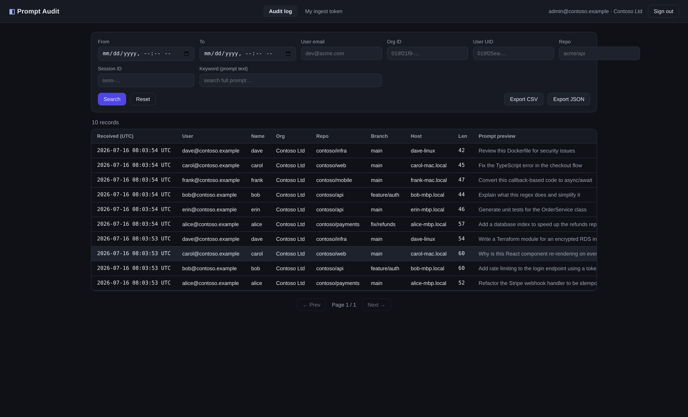

# Prompt Audit

[](https://github.com/leofang2007-maker/prompt-audit/actions/workflows/ci.yml)
[](LICENSE)

> Self-hosted audit trail for the prompts your developers send to AI coding assistants —
> the **interaction-layer** visibility your SIEM, EDR, and per-vendor consoles don't give you.

Your developers paste code, `.env` files, and context into **Claude Code, Cursor, GitHub Copilot,
Qoder** and more — and security/compliance has almost no visibility into *what actually goes into
those prompts*. Network DLP sees encrypted sessions; vendor admin consoles are per-tool,
inconsistent, and often don't show prompt **content**. prompt-audit closes that gap: a tiny
**client hook** captures each submitted prompt and reports it to a self-hosted service where
compliance/security can search, inspect, and export it.



*The audit console: filter by user / org / repo / keyword / time range, open any prompt in full,
and export CSV/JSON. Each org's admins see only their own org's prompts.*

**Use cases**

- **Compliance & security evidence** for AI-generated code (SOC 2 / GDPR): a searchable, exportable
  trail of every prompt developers send to AI coding assistants.
- **Govern "shadow AI"**: see *what* prompts — and what data — leave for AI tools, per user and per org.
- **Catch secret / IP leakage**: full-text search prompts for tokens, keys, or customer data.

## How it's different

- **Captured at the client, tool-agnostic.** Works across Claude Code / Cursor / Copilot / Qoder —
  and even when the tool talks **straight to a vendor cloud** (no proxy in the model path, no
  provider keys). This is the "agent-layer" blind spot SIEM/EDR and network DLP miss.
- **Content-level, not just usage.** The full prompt text, not only "who used how many tokens" or a
  repo name — which is all most vendor consoles expose.
- **One place, every vendor.** A single cross-vendor view instead of a different admin panel per tool.
- **Self-hosted — your prompts never leave your infra.** No third party holds developers' prompts
  (which is exactly what the sensitive data in them demands). Multi-tenant + Apache-2.0.
- **Built to be enablement, not surveillance.** Data stays on your infra; org admins see only their
  own org. (Role-scoped access, reason-logged admin views, and secret/PII redaction are on the
  [roadmap](#roadmap) — see below.)

This repo ships **both halves**: the **server** (ingest + storage + audit console) and the **Qoder
client plugin** ([`clients/qoder/`](clients/qoder/)) that captures each prompt and reports it.
Install the plugin, run the server — done. (Any tool with a pre-submit hook works; see
[`examples/`](examples/) for a generic reporter and Claude Code wiring.)

```
  AI coding tool (dev machine)                 Compliance / security team
        │ client hook                                    │ browser
        │ POST /api/v1/prompts                            │ your reverse proxy (TLS)
        │ Authorization: INGEST_TOKEN  (write-only)       │ admin session (read-only)
        ▼                                                 ▼
  ┌──────────────────  server (Spring Boot)  ──────────────────┐
  │  /  → SPA (React, baked into the jar)     /api/*  → API     │   ← 1 container
  └──────────────────────────────┬────────────────────────────┘
                                  ▼
                            MySQL  (`promptaudit` DB)
```

**One container**: the server serves both the SPA (the built React bundle is baked into the jar's
static resources) and the API — no separate web/nginx process. Put it behind your own TLS reverse
proxy. Multi-tenant: each org has its own ingest token + its own admin logins, with strict data
isolation between orgs.

## The security property (the headline)

Two **completely separate** authentication schemes, plus tenant isolation:

| Audience | Route | Auth | Can |
|---|---|---|---|
| An org's client hooks | `POST /api/v1/prompts` | that org's ingest token | **write only** |
| Org admin | `GET /api/v1/prompts[...]`, export | session JWT (role=org, tenant=X) | **read only — that org's rows** |
| Platform superadmin | + `/api/v1/tenants/*` | session JWT (role=platform) | manage orgs/tokens/admins; read all |

Two guarantees, both in [`server/.../auth/SecurityInterceptor.java`](server/src/main/java/com/gigrt/promptaudit/auth/SecurityInterceptor.java):
a leaked ingest token can't read a single record; and the owning org of a prompt is **derived from
the ingest token** (stamped as the trusted `tenant_org_id`), never from the client-claimed `org_id` —
so a machine can't forge its way into another org's data, and every admin read is filtered to its tenant.

## API

| Method | Path | Auth | Purpose |
|---|---|---|---|
| `POST` | `/api/v1/prompts` | ingest token | Report a prompt. Body (v1.0.2): `{event_id?, timestamp, session_id, user_email, user_name, user_uid, org_id, org_name, repo, branch, cwd, transcript_path, hostname, prompt}`. Only `prompt` required (else 400); every other field is optional and stored as-is (fail-open, missing ⇒ null). → `200 {"ok":true,"id":"pr_…"}`. **Idempotent on `event_id`**: a repeat (IDE double-fire / drain retry) returns the original id with `"deduplicated":true` — no new row. Logs prompt **length** only — never the token or text. |
| `POST` | `/api/v1/auth/login` | — | Login (platform superadmin from env, or an org admin from DB) → `{token, profile{role,cap,tenant,org_name}}` (`cap` = `viewer`\|`auditor`). |
| `POST` | `/api/v1/auth/logout` | admin | Stateless acknowledge (client drops token). |
| `GET` | `/api/v1/prompts` | admin | Filtered, paginated list — **isolated to the caller's tenant** (platform sees all). Params: `from,to,user_email,org_id,user_uid,repo,session_id,keyword,page,page_size`. |
| `GET` | `/api/v1/prompts/{id}?reason=…` | admin | Full record (cross-tenant id ⇒ 404). A **viewer** gets metadata + redacted preview only (`prompt_hidden`); an **auditor**/platform admin must supply `reason` and the full-text reveal is access-logged (spec [0003](docs/specs/0003-anti-surveillance-guardrails.md)). |
| `GET` | `/api/v1/prompts/export?format=csv\|json&reason=…` | auditor | Export the current (tenant-scoped) filter set. Viewers → 403; `reason` required and logged. |
| `GET` | `/api/v1/integrity` | admin | Verify the tamper-evident hash chain (spec [0001](docs/specs/0001-tamper-evident-storage.md)); reports `ok` + the first broken record, if any. Tenant-scoped. |
| `GET` | `/api/v1/access-log` · `/integrity` | admin | The "who watched the watchers" log (spec [0003](docs/specs/0003-anti-surveillance-guardrails.md)): every full-text view/export, with the reason given — itself hash-chained. Tenant-scoped. |
| `GET` | `/api/v1/transparency` | **public** | Disclosure of what's captured, that secrets are redacted, that admin access is logged, and that no productivity scoring is computed — point developers at it. |
| `GET` · `POST` | `/api/v1/coverage` · `/coverage/roster` | admin | Reporting-coverage / gap detection (spec [0004](docs/specs/0004-reporting-coverage-gap-detection.md)): active vs **went-dark** hosts, plus **never-reported** hosts against an optional roster. Host-granular; tenant-scoped. |
| `POST` | `/api/v1/tenants/{id}/admins/{aid}/role` | platform | Set an org admin's capability role (`viewer`/`auditor`). |
| `GET`·`POST` | `/api/v1/tenants` · `/{id}/rotate-token` · `DELETE /{id}` | platform | List/create orgs, rotate/revoke their ingest token. |
| `GET`·`POST` | `/api/v1/tenants/{id}/admins` · `DELETE /{id}/admins/{aid}` | platform | Manage an org's admin logins. |
| `GET`·`POST` | `/api/v1/my/tenant` · `/tenant/rotate-token` | org admin | View / rotate **your own** org's ingest token. |

## Data model

`id` · `event_id` (idempotency key, UNIQUE) · `timestamp` (client event time, RFC3339 UTC) ·
`received_at` (server time) · `session_id` · `user_email` · `user_name` · `user_uid` · `org_id` ·
`org_name` · `repo` · `branch` · `cwd` · `transcript_path` (abs path on the reporting machine —
stored, never fetched) · `hostname` · `prompt` (full text) · `prompt_length` ·
`tenant_org_id` (TRUSTED owning org, from the ingest token — the isolation key).
Indexed on `received_at`, `user_email`, `org_id`, `user_uid`, `repo`, `session_id`, `tenant_org_id`;
UNIQUE on `event_id`. Plus `tenant` (org + its token) and `admin_user` (org logins, PBKDF2) tables.

## Quick start

One command, zero external dependencies (bundles its own MySQL):

```bash
docker compose up --build     # → http://localhost:8091
```

Defaults (override in a `.env`): admin `admin@promptaudit.local` / `changeme`, ingest token
`dev-ingest-token`. Log in, create an org under **Organizations**, and it gets its own ingest token.

## Local development

Faster iteration loop — backend + frontend separately:

```bash
# terminal 1 — backend (tests use in-memory H2; for a run, point DB_* at any MySQL)
cd server
DB_HOST=… DB_USER=… DB_PASSWORD=… ADMIN_PASSWORD=changeme INGEST_TOKEN=dev-token \
  mvn spring-boot:run              # :8080

# terminal 2 — frontend (vite proxies /api → :8080)
cd web && npm install && npm run dev   # http://localhost:5173
```

Try it:

```bash
# report a prompt (write side)
curl -X POST http://localhost:8091/api/v1/prompts \
  -H "Authorization: Bearer dev-ingest-token" -H "Content-Type: application/json" \
  -d '{"timestamp":"2026-07-15T10:00:00Z","user_email":"dev@acme.com","repo":"acme/api","prompt":"refactor the auth module"}'

# then log in at http://localhost:8091 as admin@promptaudit.local / <ADMIN_PASSWORD> and browse.
```

See [`examples/`](examples/) for wiring the client hook into Claude Code or any tool.

## Layout

```
server/   Spring Boot control plane — ingest + audit API + JWT/ingest auth   (plain Spring Boot, Java 8)
          server/Dockerfile builds web/ and bakes the SPA into the jar → one self-contained image
web/      React + Vite + TS audit console — login, list/filter, detail, export
clients/  client integrations — clients/qoder/ is the Qoder plugin (UserPromptSubmit hook that
          reports each prompt, + SessionStart drain-retry for offline queueing)
ops/      build.sh / deploy.sh / example reverse-proxy config for production
examples/ generic client-hook reference (report_prompt.sh + Claude Code wiring)
```

## Configuration

All via env (see [`.env.example`](.env.example)): `DB_*` (MySQL, dedicated `promptaudit` DB),
`ADMIN_EMAIL` / `ADMIN_PASSWORD` (platform superadmin bootstrap), `JWT_SECRET`, `INGEST_TOKEN`
(optional global/bootstrap token — each org normally gets its own from the Organizations page).

## Data & persistence

Two compose files, two storage models — pick per environment:

| Run | Compose | Database | Data across redeploys |
|-----|---------|----------|-----------------------|
| Local / evaluation | `docker-compose.yml` | **bundles** its own MySQL (named volume `promptaudit-db`) | persists in the volume; empty only on the very first `up` |
| Production | `docker-compose.prod.yml` | connects to **your external** MySQL (`DB_*`) | never touched — your rows live in your MySQL |

The schema is created/upgraded at startup by Hibernate (`ddl-auto=update`) from the JPA entities —
**additive only**: it adds missing tables/columns and never drops or wipes data. So **deploying a
new image does not reset the database** — existing rows survive upgrades. (No `.sql` migrations are
shipped; for stricter production change-control, add Flyway/Liquibase.)

Neither the repo nor the image contains a database or any data — only the app + the schema
definitions (the JPA entity classes). A database is attached at runtime via `DB_*`.

## Deployment

Build one image (`ops/build.sh`) and run it with `docker-compose.prod.yml` pointed at your MySQL,
behind your own TLS reverse proxy (example nginx block in `ops/nginx-prompt-audit.site`).
See [`ops/README.md`](ops/README.md).

## Principles — enable, don't surveil

Prompt auditing is bought by security/compliance but can be killed by developer revolt. So trust is a
structural property here, not a promise:

- **No productivity scoring.** No per-developer score, ranking, or performance metric is computed or
  exposed. Not now, not as a hidden endpoint.
- **Least privilege.** Admins are `viewer` (metadata + redacted previews) or `auditor` (full text).
  New admins default to `viewer`.
- **Every reveal is accountable.** Viewing full prompt text or exporting requires a reason and is
  recorded in a hash-chained [access log](docs/specs/0003-anti-surveillance-guardrails.md) — including
  views by the platform superadmin. No silent super-user bypass.
- **Secrets aren't hoarded.** Well-formed secrets are [redacted at capture](docs/specs/0002-secret-pii-redaction.md).
- **Transparent to developers.** A public `/api/v1/transparency` endpoint discloses exactly what's
  captured and the limits above.

## Roadmap

Prioritized from real needs security/compliance teams and developers voice about AI coding tools
(see the cited [Reddit research](docs/research/reddit-2026-07.md) behind these):

Each item is a tracked issue — 👍 or comment to help prioritize:

- ✅ **[Tamper-evident storage](https://github.com/leofang2007-maker/prompt-audit/issues/1)** *(shipped)* — append-only, hash-chained records; verify via `GET /api/v1/integrity`. Design: [spec 0001](docs/specs/0001-tamper-evident-storage.md).
- ✅ **[Secret / PII redaction at capture](https://github.com/leofang2007-maker/prompt-audit/issues/2)** *(shipped)* — masks well-formed secrets (keys / tokens / private keys / `password=…`) *before* a prompt is stored or hashed, so you keep evidence (count + types) without hoarding the secret. `REDACTION_MODE=mask` by default. Design: [spec 0002](docs/specs/0002-secret-pii-redaction.md).
- ✅ **[Anti-surveillance guardrails](https://github.com/leofang2007-maker/prompt-audit/issues/3)** *(shipped)* — `viewer`/`auditor` roles, reason-required + hash-chained access log (`/api/v1/access-log`), a public `/api/v1/transparency` disclosure, and **no productivity scoring**. Design: [spec 0003](docs/specs/0003-anti-surveillance-guardrails.md).
- ✅ **[Reporting-coverage / gap detection](https://github.com/leofang2007-maker/prompt-audit/issues/4)** *(shipped)* — surfaces hosts that were reporting and **went dark**, plus (with an expected roster) hosts that **never reported**. Host-granular by design — coverage, not activity monitoring. `GET /api/v1/coverage`. Design: [spec 0004](docs/specs/0004-reporting-coverage-gap-detection.md).
- 🔄 **[More client adapters](https://github.com/leofang2007-maker/prompt-audit/issues/5)** — **Qoder** (✅ verified in a real deployment); **Claude Code / Cursor / Codex / GitHub Copilot** (⚠️ built to each tool's documented hook API, not yet live-verified). Copilot is agent-surface-only (classic chat/JetBrains aren't capturable — see [`clients/`](clients/README.md)). Specs [0005](docs/specs/0005-claude-code-adapter.md)/[0006](docs/specs/0006-cursor-codex-copilot-adapters.md); [verification status](clients/README.md).
- **[Audit-ready kit](https://github.com/leofang2007-maker/prompt-audit/issues/6)** — control-framework mappings (SOC 2 / ISO 27001) + sample evidence export.
- **[SSO/SAML + finer RBAC](https://github.com/leofang2007-maker/prompt-audit/issues/7)**.

Want one of these sooner, or something else? See **Feedback & feature requests** below.
> `ADMIN_EMAIL`/`ADMIN_PASSWORD` is the platform superadmin bootstrap; org admins live in the DB
> and are created from the Organizations page.

## Feedback & feature requests

Have a need, an idea, or hit a bug? We want to hear it — the roadmap is driven by real use cases.

- 💡 **Request a feature** → [open a feature request](https://github.com/leofang2007-maker/prompt-audit/issues/new?template=feature_request.yml) (tell us the problem / use case, not just a solution).
- 💬 **Ask or discuss** → [GitHub Discussions](https://github.com/leofang2007-maker/prompt-audit/discussions).
- 🐛 **Report a bug** → [open a bug report](https://github.com/leofang2007-maker/prompt-audit/issues/new?template=bug_report.yml).
- 🔒 **Security issue** → report privately via a [security advisory](https://github.com/leofang2007-maker/prompt-audit/security/advisories/new).

⭐ If this is useful to you, a **star** helps other teams find it.

## Contributing

See [CONTRIBUTING.md](CONTRIBUTING.md). PRs welcome — CI must pass and changes are reviewed before merge.
